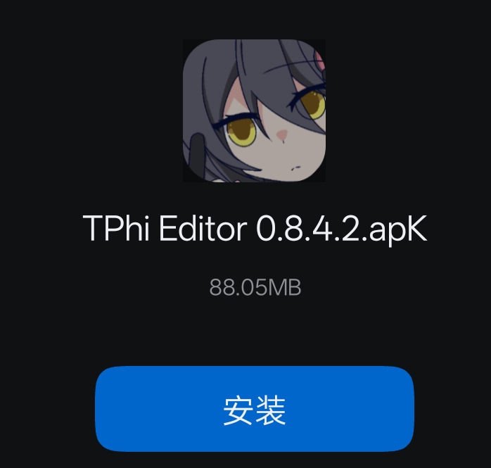
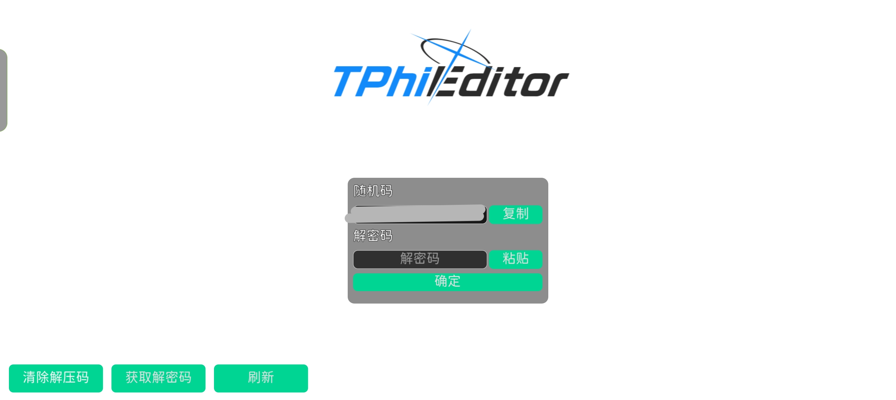

# 获取并安装

## 在此之前

你得先确保手里有过审的谱面（参见下表）。

一个视频不能超过100MB。

> [!ATTENTION] 不再允许上传ADOFAI谱面以通过审核。如果你会用ADOFAI创作谱面，那么你应该直接入门RPE（或者Phichain）。
>
> 如果是因为使用Winlator、Linux设备用ADOFAI导致自己被建议使用RPE写谱，**请按照兼容层（源代码编译或者虚拟机软件）的指南完成安装**，具体教程请自行搜索。
>
> *而且，目前为止没有任何办法要求cmdysj给任何一端做适配。（要求至少你得拿出一张上架谱面）*
>
> SteamOS用户建议使用Phichain。

| 游戏/平台名称 | 可上传谱面文件 | 可上传视频 |
| :----------- | :----------- | :--------- |
| Phigros | 可上传（*.pez） | 可上传 |
| maimai | 不支持 | 可上传 |
| 原神 | 不支持（请参考米哈游最终用户协议） | 可上传 |
| osu! | 可上传 | 可上传 |

具体要求请看审核群公告。

## 安装

在群文件寻找“TPhi Editor”文件夹，本文档以0.8.4.2版本作为演示。

在接下来的弹窗当中，选择“授权本次安装”或“继续安装”，并进行身份验证（如果有）。

## 首次运行该做的事

给TPhi Editor授权“访问所有文件的权限”，这个权限用于存放谱面文件、读取图片和音频文件（不授权这个权限会闪退）。（可以在`/storage/emulated/0/. TGPhiEdit`查看刚才创建的谱面文件）

> [!WARNING]
>
> 本应用程序不会收集任何隐私数据（无论是通话记录，短信，还是微信聊天记录），如果遇到任何问题，请联系群管。
>
> 如果仍然怀疑TPhi Editor是病毒软件，请转到[这个链接](https://www.virscan.org/report/3bc2ebdefadef54925ad6ec8da657ced0ca7a2dcde405fc114f99b0fc9278e95)查看杀毒查杀报告（报告来源：VirScan）。
> 
> *If it says that one or two virus scanners flagged it, that usually means it's a false positive. Only if a significant portion of the virus scanners flag it there might really be a virus in it.* - WorldPainter.net1对于病毒误报的说明

首次运行时的界面如下：

复制随机码，然后将随机码发给群里的任意一个审核员，等个最多一两天。

> 不需要再次发送谱面文件，除非你没有进入TPhi Editor主群。
>
> 在解密码过去过程中，你可以关闭TPhi Editor。

收到解密码后将其粘贴到“解密码”输入框中，点击确认。

如果没有任何报错，就可以开始写谱了。

## 限制

第一个设备私发给审核员，第二个设备请将设备运行TPhi Editor的界面拍照（不要截图！）私发给审核员。

> [!WARNING]
>
> 请勿尝试给制谱团队批量部署TPhi Editor，可能会引起不必要的麻烦。
>
> 这个限制可能在某个未来得到民间解决方案。

## 另请参阅

1：[https://www.worldpainter.net/trac/wiki/FalsePositives](https://www.worldpainter.net/trac/wiki/FalsePositives)

2：[如何不说假话地制作一份网络安全谣言？ - 龙腾猫跃](https://bilibili.com/opus/718413265600774179)