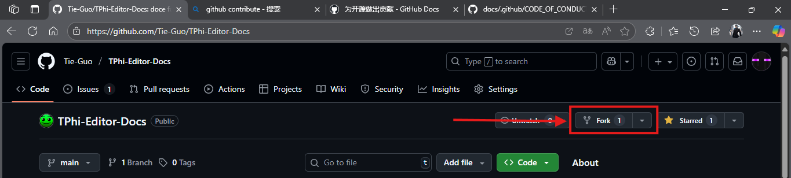
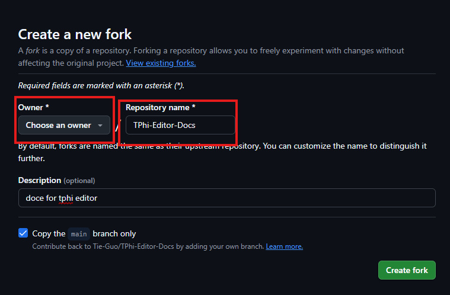
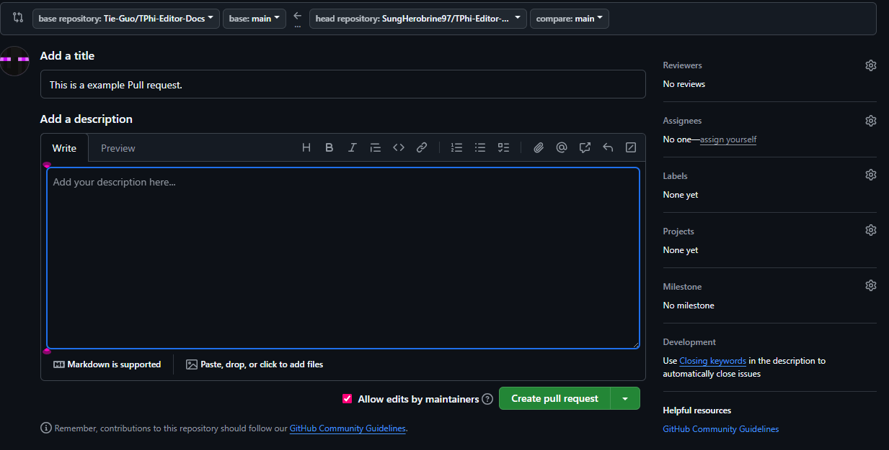

# 本文档站的贡献者指南

## 开始之前

需要准备以下工具：
* Github账户（没有账户的可以去[这个链接](https://github.com/signup)注册一个）
* 熟悉一下Git
* 一定的TPhi Editor使用经验（看到侧边栏的邪修教程了吗？）
* 一些其他软件的使用经验（具体软件看下列列表，不要求全部掌握）
    * Adobe Photoshop或者Clip Studio Paint
    * Re:PhiEdit（必须）
    * Microsoft 365
    * 一定的防骗知识（本文后面会讲）
    * Markdown语法经验（必须）
* 起码把[Docsify官方文档](https://docsify.js.org)看一遍（**别用Github Actions脚本，会出事的**）

## 创建一个fork仓库

首先，我们转到[这个仓库](https://github.com/Tie-Guo/TPhi-Editor-Docs)。

然后点击上面的Fork（看下图）。



在接下来的页面中，给仓库名称命名并选择所有之后，点击“Create Fork”。



> 这里的Description是可以留空的，但是为了方便所有创作者，建议写上。**一句话概括就行。**

之后找到你刚才创建的fork，像往常一样clone，pull和push。

有关Git的一些教程参考[此处](https://git-scm.com/book/zh/v2)。

## 上传图时要注意的点

使用Markdown上传时，只跟图像就好。

``` Markdown

```

如果后面是想用HTML上传，请以index.html所在的位置作为相对路径的起点（为什么）。

``` HTML

```

## Git推送相关

首次推送仓库前，请运行一下这个命令（前面的路径可忽略，相关的虚构用户名和电子邮箱仅为演示）：

> [!ATTENTION] **请勿按原样复制文中的命令**，实际的用户名和电子邮件地址请替换成自己的，因按原样复制导致的严重后果与作者无关。
> 
> 并且Git用户名命名时遵循一条规则：*Username may only contain alphanumeric characters or single hyphens, and cannot begin or end with a hyphen.*

```terminal
$|git config --global user.name "Carlotta"
$|git config --global carlotta@montelli.onmicrosoft.com
```

之后按照你所用的代码编辑器的源代码管理集成完成提交和仓库推送（你会被要求登录到Github）。

> [!WARNING] 如果你在推送更改时遇到报错，请勿惊慌。尝试更换网络环境并重新推送更改（本地文件绝对没事）。

## 最后，去开一个Pull Request！

回到你刚才克隆的仓库主页，如果找不到你仓库了，请在仓库根目录运行`git remote -v`来查看远程仓库的URL。

在你的fork仓库主页，点击contribute，然后点击Create Pull Request。

在点击之后的下一个页面填写你的标题和描述后，点击Create Pull Request（如下图）。



最后稍等不知道1天还是2天就行了，如果你的Pull Request被打回，这些审核员会告诉你原因。

## 谨防诈骗

尽管这个仓库撑死只有一个index.html和若干个markdown文档组成，但是：

绝大多数情况下**只需复制报错信息到Bing或者Github**就可以查到一些答案，但也有可能会一无所获。

目前为止，Re:PhiEdit和TPhi Editor都不是可公开获得的软件（出于某些原因），获取Re:PhiEdit时，请认准cmdysj，谨防假冒。（如果有其他人声称有Re:PhiEdit源码，拉黑并举报就是。）而TPhi Editor，请按照[这个指南](/before-begin.md)来获取TPhi Editor。

> *首先，我建议直接屏蔽CSDN，除了新添的仅VIP可阅读之外，先前就充斥着各种复制粘贴的文档，非常浪费你要解决问题搜索时造成的无效搜索。在中文互联网搜索不到你想要的结果时，可以试试别的搜索引擎，比如Bing，Google。*
>
> *此外，很多微信公众号个人比较反感，首先，他们无法被搜索引擎检索，这就与“共享”的初衷违背，其次，这里面通常夹带私货，同时公众号也开始收费，会劝退更多在这上面分享信息的个人开发者，导致整体质量进一步下降。*
>
> *其次，远离培训班，无论他说的有多好听，他一开始就打着“赚大钱/高新”的旗号面向文科转码，CS0基础的非科班生人群报名，报名费往往上万先不提，同时也和这篇文章的目标读者大概率不符，我个人也看过一些免费视频，节奏真的很慢，就像是从1+1=2开始教起，当然这里不是夸她细致，你这样想，如果技术足够优秀的开发者，他更可能在大厂而不是在xx培训班开设课程教你们，此外，很多优秀开发者都会写博客/开源书，你更应该看这些而不是培训班的免费视频/课程，对于ACM也是一回事（对于ACM，除非真的是认证过的ICPC金牌选手的课也许有帮助（虽然出发点也存疑））* —— Shanwer's Blog（M.W.D.可没在给Shanwer打广告）

## 其他

如果想自己写一个教程，请参考[此处](custom-tutorial)。