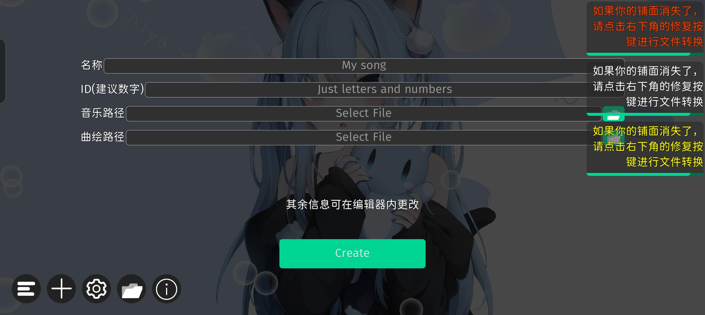

# 新手教程：新建谱面文件

本教程作者：MixerWangDev

## 先决条件

你已经安装并激活TPhi Editor。

## 步骤以及注意事项

### 获取音频文件

本文不提供相关教程，烦请去其他站点寻找方法。

> **关于Github的DMCA删除通知不得不说的一些事情**
>
> 出于尊重版权等相关原因，有的时候不提供相关教程对于某些人而言可能会不理解。如果本教程提供了其他获取音频文件的方法，那么这个站点绝对会吃到DMCA版权删除通知。
>
> 而且，GitHub对于DMCA版权删除通知的处理时间**只有24小时**，超过这个处理时间只能联系Github开第二个窗口期。（一个仓库有且只有一次机会）
>
> 如果你是作者，并且要在类似的海外站点写教程，**请确保你所做的尊重每一个创作者的劳动成果**。

### 绘制曲绘文件

曲绘占位符文件可以在“附件”这一部分获取。（可商用，无须担心版权问题）

曲绘的画布要求：`2048×1080 72ppi`

如果你不确定，可以试着用A4纸的画布绘制一个。

绘制曲绘时需注意（可以翻一些国内软件的服务条款会有这内容）：

> 用户不得利用本软件或本软件服务制作、上载、复制、发送如下内容：
>
> 1. 反对宪法所确定的基本原则的；
> 2. 危害国家安全，泄露国家秘密，颠覆国家政权，破坏国家统一的；
> 3. 损害国家荣誉和利益的；
> 4. 煽动民族仇恨、民族歧视，破坏民族团结的；
> 5. 破坏国家宗教政策，宣扬邪教和封建迷信的；
> 6. 散布谣言，扰乱社会秩序，破坏社会稳定的；
> 7. 散布淫秽、色情、赌博、暴力、凶杀、恐怖或者教唆犯罪的；
> 8. 侮辱或者诽谤他人，侵害他人合法权益的；
> 9. 含有法律、行政法规禁止的其他内容的信息。

### 新建谱面文件

> [!TIP] 如果你一不小心把TPhi Editor收纳进游戏空间里了（并且删除了桌面快捷方式），请先打开游戏空间。

1. 打开TPhi Editor。
2. 点击“加号”，转到“新建谱面”页面。

3. 填写曲目名称和ID，点击文件夹图标分别选择曲绘和音频文件。

> [!ATTENTION] 在选择曲目音频文件和曲绘时一定要小心，如果编辑器报错请尝试用格式工厂重新转换成编辑器支持的格式。
>
> 目前仅支持`*.ogg`，`*.mp3`，`*.wav`，`*.png`，`*.jpg`这些格式的文件，其他文件请先转换成上述格式。

4. 点击“Create”。

这样就可以了。

## 附件

曲绘占位符可在[123网盘链接](https://www.123865.com/s/S7oiVv-l90Sv)获取。