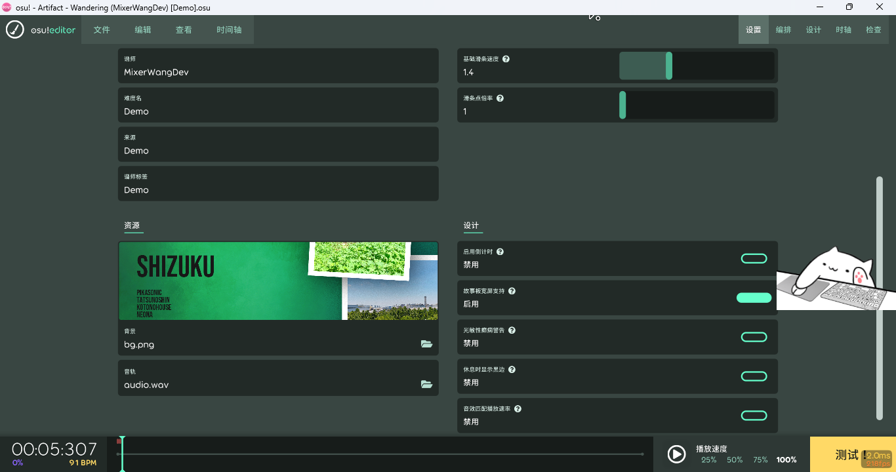
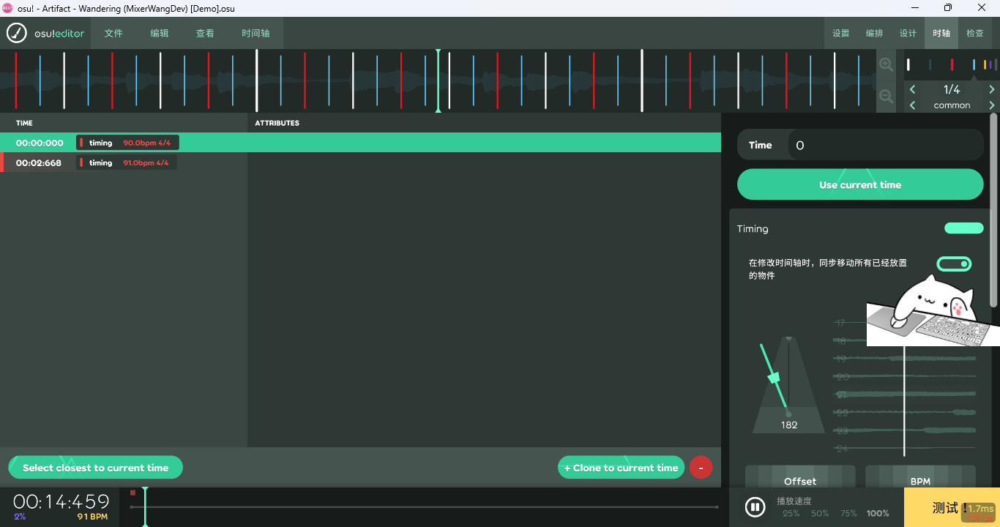

# 变速BPM列表设置

教程作者：M.W.D.

## 演示曲目

Cinamoro - Wandering

## 所涉及的软件

- Malody/osu!lazer（备选）

## 先决条件

> [!ATTENTION] 本文档站不提供付费素材的下载，请自行前往对应的Bandcamp购买。
>
> 所用的曲目具有BPM变速，为了教学方便起见，我们只需叠到160。而实际情况下，你可以给BPM除以2（或者乘以2），按你自己喜好做就行。

## 步骤

> 本教程以osu!lazer版本为例，其他软件的具体方向和效果大体上是一致的（撑死位置不同）

1. 启动osu!lazer

2. 点击编辑器 > 谱面编辑器

如图。（不要打我的猫猫）

3. 把你的曲目文件拖进来（拖进窗口里就行了）。
4. 转到“时轴”选项卡（如图）。

### 添加BPM

直接点击“Add at current time”，添加基础BPM。（*~~此时噩梦才刚开始。~~*）

将BPM值填写为90。

接下来在第四拍填写BPM为91，后续填写的BPM如下表。

| 节拍数 | BPM |
| :--- | :--- |
| 0 | 90 |
| 4 | 91 |
| 8 | 92 |
| 12 | 94 |
| 16 | 96 |
| 20 | 99 |
| 24 | 102 |
| 28 | 105 |
| 32 | 109 |
| 36 | 113 |
| 40 | 118 |
| 44 | 123 |
| 48 | 128 |
| 52 | 133 |
| 56 | 138 |
| 60 | 144 |
| 64 | 152 |
| 68 | 160 |

## 附件

本教程不提供曲目文件（请自行前往Cinamoro的BandCamp获取）